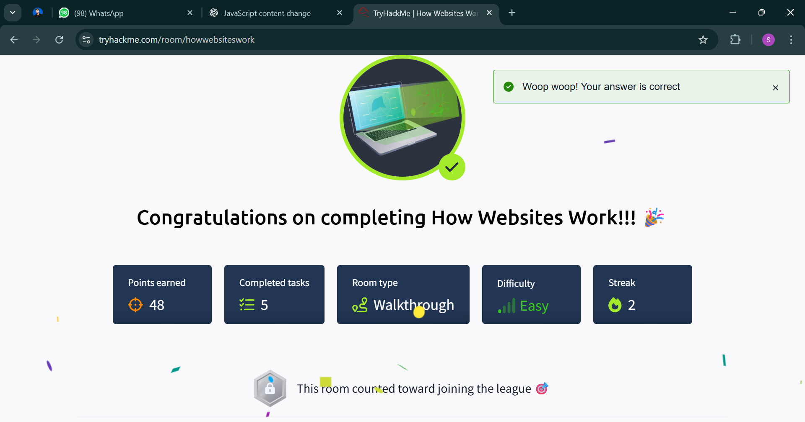

# How Websites Work & HTTP Protocol – TryHackMe

---

## 1. How Websites Work – Complete Cycle

### 1.1 Client-Server Model
- **Client (Browser):** Software like Chrome or Firefox that sends a request to a web server.
- **Server:** Responds with requested content like HTML, CSS, JavaScript files, or data.
- **Flow:**
  1. User enters a URL (e.g., `https://example.com`).
  2. Browser queries the **DNS** to find the IP address of the domain.
  3. A **TCP connection** is made to the server (default port 80 for HTTP, 443 for HTTPS).
  4. Browser sends an **HTTP Request**.
  5. Server responds with an **HTTP Response**.
  6. Browser renders the page (HTML + CSS + JS).

---

### 1.2 DNS Resolution Cycle
DNS translates human-readable domain names into IP addresses.

**Step-by-step DNS Lookup:**
1. Browser checks its local DNS cache.
2. If not found, it queries the **OS resolver cache**.
3. The request is forwarded to the **recursive DNS resolver** (usually provided by your ISP).
4. The recursive resolver asks the **Root DNS Server** for the TLD server (e.g., `.com`).
5. The **TLD server** returns the authoritative server details.
6. The **Authoritative Name Server** responds with the domain's IP.
7. The browser now connects to the server IP.

---

### 1.3 Rendering Process
- **HTML** defines the structure.
- **CSS** handles the styling.
- **JavaScript** enables interactivity.
- The browser builds the **DOM (Document Object Model)**, **CSSOM (CSS Object Model)**, merges them into a **Render Tree**, and paints it to the screen.

---

## 2. HTTP Protocol in Detail

### 2.1 What is HTTP?
- **HTTP (HyperText Transfer Protocol)** is the foundation of communication between browsers and servers.
- Operates over TCP/IP.
- **Stateless protocol** – each request/response is independent.

---

### 2.2 HTTP Request Format
1. **Request Line:**  
   Example: `GET /index.html HTTP/1.1`
2. **Headers:**  
   - `Host: example.com`
   - `User-Agent: Mozilla/5.0`
   - `Accept: text/html`
3. **Body (optional):**  
   Data for POST/PUT requests.

---

### 2.3 HTTP Response Format
1. **Status Line:**  
   Example: `HTTP/1.1 200 OK`
2. **Headers:**  
   - `Content-Type: text/html`
   - `Content-Length: 348`
   - `Set-Cookie: sessionid=abc123`
3. **Body:**  
   The actual content (HTML, JSON, files).

---

### 2.4 HTTP Methods
- **GET:** Retrieve resources.
- **POST:** Submit data to server.
- **PUT:** Replace a resource.
- **PATCH:** Partially update a resource.
- **DELETE:** Remove resource.
- **HEAD:** Retrieve headers only.

---

### 2.5 HTTP Status Codes
- **1xx – Informational:** (e.g., 100 Continue)
- **2xx – Success:** (200 OK, 201 Created)
- **3xx – Redirection:** (301 Moved Permanently, 302 Found)
- **4xx – Client Errors:** (400 Bad Request, 404 Not Found)
- **5xx – Server Errors:** (500 Internal Server Error)

---

### 2.6 HTTPS vs HTTP
- **HTTP:** Data travels as plain text (insecure).
- **HTTPS:** Encrypts data using **TLS/SSL**.
- **TLS Handshake:**  
  - Browser and server exchange keys.
  - Session key is generated for encrypted communication.

---

### 2.7 Cookies & Sessions
- **Cookies:** Small pieces of data stored in the browser (e.g., session IDs).
- **Sessions:** Server-side data linked to a user, referenced by a cookie.

---

## 3. Full Web Cycle (DNS + HTTP)
1. User types a URL (e.g., `https://example.com`).
2. DNS resolves the domain to an IP address.
3. Browser initiates a **TCP 3-way handshake** with the server.
4. For HTTPS, a **TLS handshake** is performed.
5. Browser sends an **HTTP GET request**.
6. Server responds with **HTTP 200 OK + HTML**.
7. Browser fetches additional resources (CSS, JS, images).
8. Page is rendered for the user.

---

## 4. Badges & Progress

**Completed Rooms:**
- How Websites Work
- HTTP in Detail

**Badges:**  
  

---
