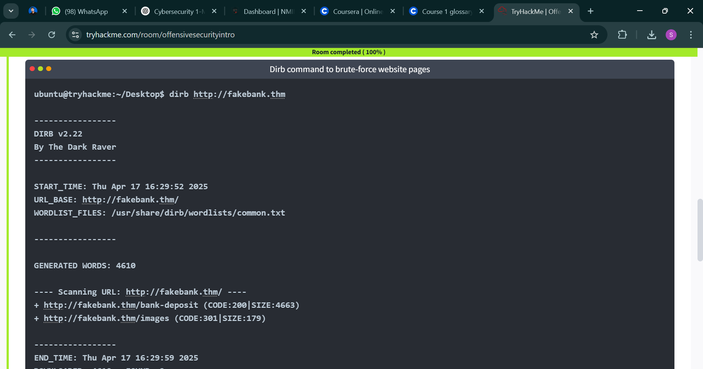

✅ Offensive Security Intro
What it is: The practice of ethically hacking into systems to find vulnerabilities before malicious hackers do. Focuses on attack simulations.

Why it matters: Helps organizations identify weak points in their defenses proactively.

What I did:

Completed the Offensive Security Intro room on TryHackMe.

Performed my first legal, guided hack on a simulated website environment.

Mindset learned:

Think like an attacker to secure systems better.

Always document findings so they can be fixed.

✅ Defensive Security Intro
What it is: Strategies & tools to detect, prevent, and respond to attacks.

Key areas explored:

🔍 Threat Intelligence: Researching new threats, vulnerabilities, and attack trends.

🖥 SOC (Security Operations Center): A team that monitors & manages security incidents 24/7.

🕵️ DFIR (Digital Forensics & Incident Response): Investigates breaches to find out how attackers got in and limit the damage.

🛠 SIEM (Security Information & Event Management): Aggregates logs & triggers alerts on suspicious activity.

🧬 Malware Analysis: Breaks down malicious software to understand how it works and how to stop it.

What I learned:

Defensive security is about reducing risk and impact, building resilience, and continuous monitoring.
